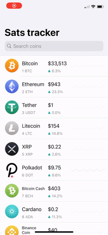

# Sats tracker 

Simple crypto currencies price tracking app. Displays the latest price and daily USD candles.

### Code base demonstrates:
   
- Basic VIPER architecture implementation. (iOS version of clean architecture.)
  - Bootstrapping simple service directory
  - Basic modules implementation
  - Implementation and orchestration of services
- Interaction with [coincap.io](https://coincap.io/) API to fetch the latest price
- Asynchronous image loading and caching. Only loading images for currently visible cells via `OperationQueue`. Operation is canceled when cell is no longer visible        
- Operation based candle loading much like images above.
- Persisting user data (Favourite assets)
- Simple fuzzy search for `UISearchController`

Fork of the app was published on the [AppStore](https://apps.apple.com/app/sats-tracker/id1546547376).

### TODO:
- [] Cache for markets for asset
- [] Test coverage
- [] Switch to diffable for assets screen 
- [] Refactor `makeViewModel` to return complete view model
- [] Axes for `CandleView` in `AssetDetailView`
- [] Widget
- [] Complications
- [] Add Time frame picking options to `Assets` module 
- [] Base pair options

### Licence 

[WTFPL 2.0](http://www.wtfpl.net/txt/copying)

